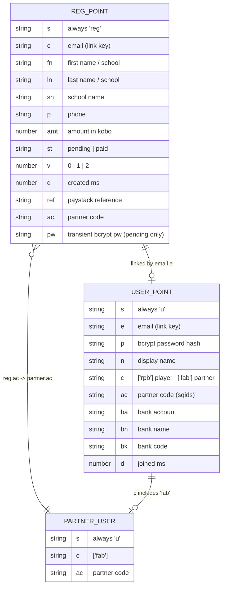
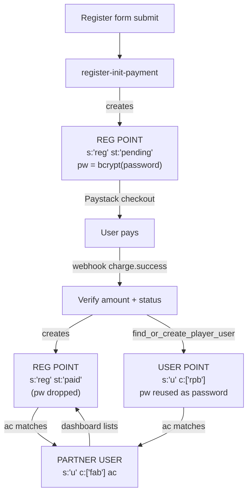

# Data Model: Reg Points vs User Points

Both are **Qdrant points in a single collection `i`**, separated by the tenant
field `s`. A **reg point** records a chess-championship registration; a **user
point** records a signed-in account. They are linked by email `e`.

## Entity diagram

## Lifecycle (how a reg point becomes a user point)

## Key rules

- **Link key is email `e`**, not the Qdrant point id.
- A `pending` reg point holds the password hash in `pw`; once payment is
  confirmed a `paid` reg point is written **without** `pw`, and the hash is
  moved onto the user point.
- A partner is just a user point with `c` containing `'fab'` and its own `ac`.
  A registration references its partner via `ac`; the partner dashboard queries
  `reg` points where `ac` equals the partner's code.
- `find_or_create_player_user` dedupes on email: an existing user only gets the
  `'rpb'` classification added, never a duplicate point.
